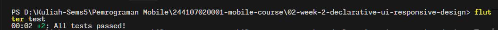
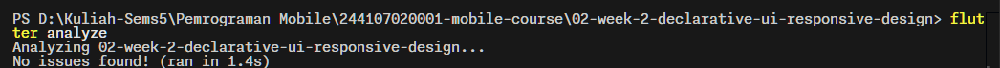
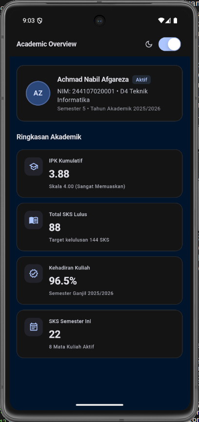
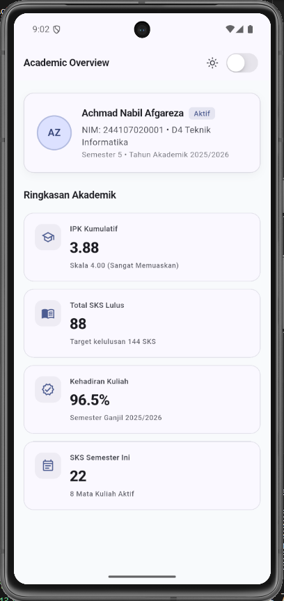
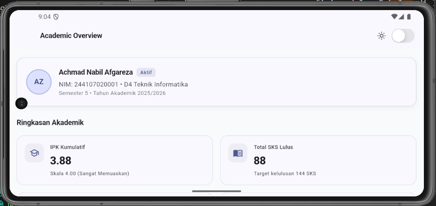

# Week 2 - Declarative UI & Responsive Design: Academic Overview Dashboard

## Deskripsi Proyek

Penerapan implementasi halaman **Academic Overview Dashboard** pada Flutter yang dibangun dengan pendekatan deklaratif UI, desain responsif multi-platform (layar sempit dan layar lebar), dukungan tema terang/gelap adaptif, serta standar aksesibilitas inklusif (*accessibility-first*).

---

## Tugas Utama & Refactoring Challenge (Academic Overview)

## 1. Fitur Utama & Struktur Widget

Aplikasi dibangun menggunakan kombinasi widget fundamental Flutter: `Row`, `Column`, `Expanded`, dan `Container` dengan hierarki yang bersih dan terstruktur.

1. **Header Profil Mahasiswa (`ProfileHeaderCard`)**:
   - Menampilkan inisial avatar mahasiswa, nama lengkap, status keaktifan (`Aktif`), NIM, Program Studi, dan semester berjalan.
   - Menggunakan `Container` dengan border halus dan bayangan lembut (*subtle tonal surface*).
   - Menggunakan `Row` untuk tata letak avatar dan informasi teks, serta `Expanded` agar teks fleksibel dan tidak *overflow*.
   - Dilengkapi `Semantics` deskriptif untuk *screen reader*.

2. **Empat Kartu Informasi Akademik (`InfoCard`)**:
   - **IPK Kumulatif**: Nilai 3.88 / 4.00 (*Sangat Memuaskan*).
   - **Total SKS Lulus**: Nilai 88 SKS (Target kelulusan 144 SKS).
   - **Kehadiran Kuliah**: Nilai 96.5% (Semester Ganjil 2024/2025).
   - **SKS Semester Ini**: Nilai 22 SKS (8 Mata Kuliah Aktif).
   - Masing-masing kartu menggunakan widget `Card` modern Material 3, berpadu dengan `Row`, `Column`, `Expanded`, dan `Container` berikon representatif.

3. **Tata Letak Responsif**:
   - Menggunakan `LayoutBuilder` untuk mendeteksi `maxWidth`.
   - Menggunakan konstanta breakpoint tunggal: `const double kWideBreakpoint = 700;`.
   - **Layar Sempit (< 700px)**: Tata letak 1 kolom vertikal.
   - **Layar Lebar (>= 700px)**: Tata letak 2 kolom sejajar menggunakan `Row` dan `Expanded`.

4. **Tema Terang & Gelap Adaptif**:
   - Mendukung `ThemeMode.light` dan `ThemeMode.dark` dengan kontras warna yang nyaman di mata (*monochrome slate/indigo/deep dark*).
   - Toggle tema menggunakan `CupertinoSwitch` di AppBar dengan label `Semantics` adaptif.
   - Semua warna dan tipografi mengambil nilai dinamis dari `Theme.of(context).colorScheme` dan `Theme.of(context).textTheme`.

5. **Aksesibilitas (*Accessibility-First*)**:
   - Setiap kartu informasi dan tombol penting dibungkus dalam widget `Semantics` dengan deskripsi jelas.
   - Switch tema memiliki label status dan petunjuk aksi (*hint*).

---

## 2. AI Prompt Challenge & Eksplorasi Desain

### Challenge 1: Prompt Desain
**Prompt:**
> *"Bandingkan dua tata letak dashboard akademik untuk Flutter: versi GridView dan versi LayoutBuilder + Column. Jelaskan trade-off responsif dan aksesibilitasnya."*

**Hasil & Analisis AI:**
| Aspek | Versi `GridView` (`GridView.count` / `GridView.builder`) | Versi `LayoutBuilder` + `Column` / `Row` |
| :--- | :--- | :--- |
| **Kontrol Rasio & Tinggi** | Bergantung pada `childAspectRatio`. Jika konten teks memanjang atau pengguna memperbesar ukuran *font* sistem (aksesibilitas), `GridView` rentan mengalami *overflow* vertikal karena tinggi kartu terkunci oleh rasio lebar. | Fleksibel (*intrinsic height*). Tinggi kartu menyesuaikan isi konten teks dan skala ukuran font tanpa terkunci rasio kaku. |
| **Responsivitas Breakpoint** | Mudah menentukan `crossAxisCount` berdasarkan lebar layar, namun kartu di baris yang sama dipaksa memiliki tinggi seragam berdasarkan *aspect ratio*. | Sangat adaptif. Dapat dengan mudah beralih dari satu kartu per baris menjadi pasangan `Row` berisi dua `Expanded` kartu pada layar lebar. |
| **Aksesibilitas (*A11y*)** | Navigasi fokus *TalkBack / VoiceOver* mengikuti urutan grid dua dimensi, namun jika terjadi pemotongan teks akibat *aspect ratio*, informasi tidak terbaca sempurna oleh pengguna pembaca layar. | Urutan pembacaan semantik lebih alami (*linear reading flow*). Konten teks tidak terpotong saat *font scaling* diaktifkan oleh pengguna tunanetra/low vision. |
| **Performa Scroll** | Lazy loading bawaan (efisien jika memiliki puluhan/ratusan kartu). | Dirender sekaligus di dalam `SingleChildScrollView` (sangat optimal dan ringan untuk dashboard dengan 4–10 kartu informasi). |

**Keputusan yang Dipilih & Alasan Teknis:**
> Kami memilih pendekatan **`LayoutBuilder` + `SingleChildScrollView` + `Column` (dengan `Row` + `Expanded` pada layar lebar)**.
> **Alasan Teknis:** Halaman *Academic Overview* memiliki jumlah kartu ringkasan terukur (4 kartu utama). Pendekatan ini memberikan kebebasan penuh pada tinggi konten (*content-driven height*), menjamin tidak adanya teks terpotong ketika pengguna mengaktifkan fitur pembesaran huruf sistem (*large text accessibility*), serta menghindari bug umum `childAspectRatio` yang sering terjadi pada `GridView`.

---

### Challenge 2: Prompt Penguatan Konsep
**Prompt:**
> *"Jelaskan kapan penggunaan Expanded justru menyebabkan overflow di dalam Row, beri contoh kode yang gagal dan perbaikannya."*

**Hasil & Penjelasan Teknis:**
Widget `Expanded` dirancang untuk mengisi ruang horizontal yang tersisa di dalam `Row`. Namun, `Expanded` justru dapat menyebabkan *assertion failure* / layout overflow pada kondisi berikut:

1. **Row Berada di Dalam Ruang Tanpa Batas Lebar (*Unbounded Width Constraints*)**:
   - Jika `Row` ditempatkan langsung di dalam parent dengan lebar *unbounded* (misalnya `SingleChildScrollView(scrollDirection: Axis.horizontal)`, `ListView(scrollDirection: Axis.horizontal)`, atau `Stack` tanpa batas horizontal), `Row` memiliki lebar tak terhingga (`double.infinity`).
   - `Expanded` mencoba menghitung sisa ruang dengan rumus: `(lebar_parent - lebar_anak_non_flex)`. Karena lebar parent tak terhingga, Flutter melempar error:
     > `RenderFlex children have non-zero flex but incoming width constraints are unbounded.`

2. **child di Dalam Expanded Memiliki Batasan Minimum Lebih Besar dari Ruang yang Tersedia**:
   - Jika anak di dalam `Expanded` memiliki widget dengan lebar tetap (`SizedBox(width: 500)`) yang lebih besar dari lebar yang dialokasikan oleh `Expanded`, atau jika terdapat teks panjang yang dipaksa `softWrap: false` tanpa elipsis.

---

### Challenge 3: Verification Prompt (Self-Audit)
**Prompt:**
> *"Periksa kembali rekomendasi layout di atas: apakah tetap responsif di bawah 600px, apakah mengurangi aksesibilitas, dan apakah ada widget yang tidak tersedia di Flutter stabil saat ini?"*

**Hasil Audit & Bukti Verifikasi:**
1. **Responsivitas di Bawah 600px:**
   - **Terverifikasi Aman:** Pada layar sempit (misal 400px x 800px), sistem beralih ke tata letak 1 kolom (`isWide = false`). Seluruh kartu mengambil lebar penuh dikurangi *padding* horizontal (368px). Seluruh konten teks dibungkus dalam `Expanded`/`Flexible` sehingga tidak terjadi *RenderFlex horizontal overflow*.
   - Halaman dibungkus dengan `SingleChildScrollView` sehingga tidak terjadi *bottom overflow* saat orientasi layar diputar (*landscape*).

2. **Dampak terhadap Aksesibilitas:**
   - **Terverifikasi Sangat Baik:** Tidak mengurangi aksesibilitas sama sekali. Justru meningkatkan aksesibilitas karena:
     - Menggunakan widget `Semantics` eksplisit untuk pembaca layar (*screen reader*).
     - Menghilangkan risiko *text clipping* yang sering dialami oleh `GridView` dengan `childAspectRatio` tetap.
     - Kontras warna teks memenuhi kriteria WCAG AA pada light mode maupun dark mode.

3. **Ketersediaan Widget pada Flutter Stabil:**
   - Seluruh widget yang digunakan (`Scaffold`, `AppBar`, `CupertinoSwitch`, `LayoutBuilder`, `SingleChildScrollView`, `Column`, `Row`, `Expanded`, `Container`, `Card`, `Semantics`) merupakan widget standar dan stabil di Flutter SDK versi terkini (Flutter 3.x).
   - Penggunaan method warna telah diperbarui ke API standar Flutter 3.27+ (`color.withValues(alpha: ...)` dan `CupertinoSwitch(activeTrackColor: ...)`), memastikan nol *deprecation warning*.

---

## 3. Refactoring Challenge

Setelah implementasi awal berhasil, dilakukan proses *refactoring* menyeluruh sesuai kriteria tugas:

1. **Ekstrak kartu informasi menjadi widget reusable (misal InfoCard) yang menerima title dan value, sehingga tidak ada duplikasi widget.**:
   - **Solusi**:
   - Kartu informasi diekstrak menjadi StatelessWidget `InfoCard` independen yang menerima parameter:
     - `required String title`
     - `required String value`
     - `String? subtitle`
     - `IconData? icon`
   - Mencegah duplikasi kode pada pembuatan keempat kartu informasi akademik.

2. **Ganti warna dan ukuran yang di-hardcode dengan Theme.of(context) agar mengikuti tema terang/gelap secara otomatis.**:
   - **Solusi**:
   - Menghapus seluruh *hardcoded color* (seperti `Colors.indigo`, `Colors.white`, dll.) dari komponen kartu dan header.
   - Semua warna kini terikat ke `colorScheme.surface`, `colorScheme.primary`, `colorScheme.outlineVariant`, `colorScheme.onSurfaceVariant`, dll.
   - Tipografi menggunakan `theme.textTheme.titleMedium`, `headlineSmall`, `bodyMedium`, dan `labelSmall` secara konsisten.

3. **Pindahkan breakpoint ke satu konstanta bernama (misal const kWideBreakpoint = 700;) agar hanya didefinisikan satu kali.**:
   - **Solusi**:
   - Nilai breakpoint dipindahkan ke konstanta tunggal:
     ```dart
     const double kWideBreakpoint = 700;
     ```
   - Menjamin konsistensi breakpoint di seluruh aplikasi.
---

## 4. Testing Dasar

Widget test menguji skenario responsif menggunakan simulasi `tester.view.physicalSize`:
1. **Layar Sempit (400 x 800)**: Memverifikasi kartu informasi berada dalam 1 kolom dengan lebar kartu `< 700px` (aktual: 368px).
2. **Layar Lebar (1200 x 800)**: Memverifikasi kartu informasi berada dalam 2 kolom dengan lebar kartu `> 500px` (aktual: 576px).

Hasil eksekusi: 


---

## 5. Refleksi

1. **Perbedaan Cara Berpikir Imperative dan Declarative:**
   Pada paradigma imperative, pengembang fokus pada instruksi langkah demi langkah (*how to do it*) untuk memanipulasi elemen UI secara manual setiap kali terjadi aksi (misalnya memanggil `setText()` atau `setVisibility()`). Sebaliknya, pada paradigma declarative (seperti Flutter), UI diposisikan sebagai fungsi murni dari status data saat itu ($UI = f(state)$); pengembang cukup mendeskripsikan struktur antarmuka untuk kondisi tertentu, lalu sistem framework secara otomatis merekonstruksi dan merender ulang widget ketika *state* diperbarui melalui mekanisme reaktif (seperti `setState`).

2. **Kapan Expanded Membantu vs Menghasilkan Layout Error:**
   `Expanded` sangat membantu ketika anak widget di dalam `Row` atau `Column` perlu mengisi sisa ruang yang tersedia secara proporsional dan dinamis sehingga mencegah elemen teks meluap (*overflow*) di ruang terbatas (*bounded constraints*). Namun, `Expanded` justru memicu error (*RenderFlex assertion failure*) saat diletakkan di dalam container yang dimensi ruangnya tidak berbatas (*unbounded constraints*)—seperti di dalam `Row` yang berada di dalam `SingleChildScrollView` horizontal atau `ListView` horizontal—karena sistem Flutter tidak dapat menghitung alokasi sisa ruang dari dimensi yang bernilai tak terhingga (`double.infinity`).

3. **Pengaruh Breakpoint dan Theme terhadap Pengalaman Pengguna (UX):**
   Breakpoint yang terencana menjamin antarmuka tetap ergonomis dan proporsional di berbagai ukuran perangkat; informasi tersusun rapi dalam 1 kolom yang mudah dijangkau di layar ponsel serta memanfaatkan ruang secara efisien dalam 2 kolom di layar tablet/desktop tanpa terasa sempit maupun kosong. Sementara itu, sistem tema adaptif (light dan dark theme) dengan kontras yang terstandarisasi menjaga keterbacaan teks di segala kondisi pencahayaan lingkungan sekaligus mengurangi kelelahan mata pengguna (*eye strain*), sehingga interaksi terasa nyaman, konsisten, dan inklusif.

4. **Verifikasi Rekomendasi AI setelah Tugas Inti Selesai:**
   Hal yang diverifikasi dari saran AI mencakup ketahanan tata letak pada batas layar ekstrem (memastikan tidak terjadi *RenderFlex overflow* di bawah 600px saat orientasi horizontal/vertikal), dampak aksesibilitas (memastikan teks tidak terpotong akibat rasio kaku serta label semantik terbaca utuh oleh *screen reader*), validitas sintaks terhadap Flutter SDK versi stabil terkini (memperbarui API yang sudah *deprecated* seperti migrasi ke `.withValues()` dan `activeTrackColor`), serta kepastian bahwa seluruh widget test responsif lolos pengujian secara otomatis (`flutter test`) dan `flutter analyze` menghasilkan nol peringatan.

---

## Preview Hasil Akhir Tugas

- **Dark Mode:**
  
- **Light Mode:**
  
- **Landscape Mode (2 Kolom):**
  


