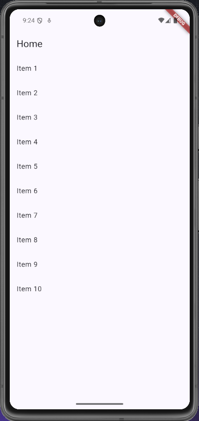
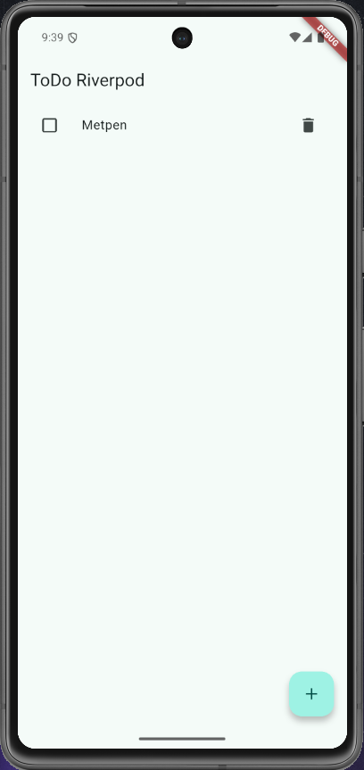
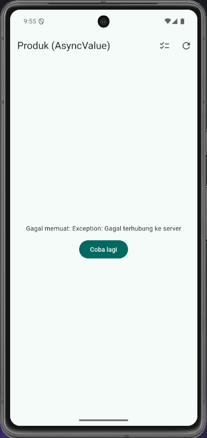
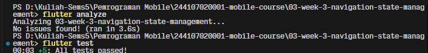
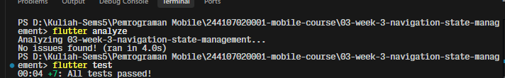
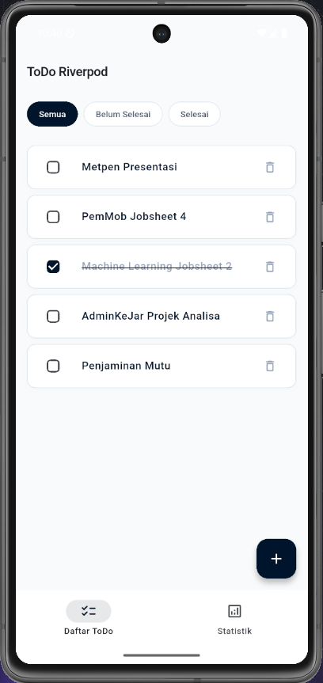
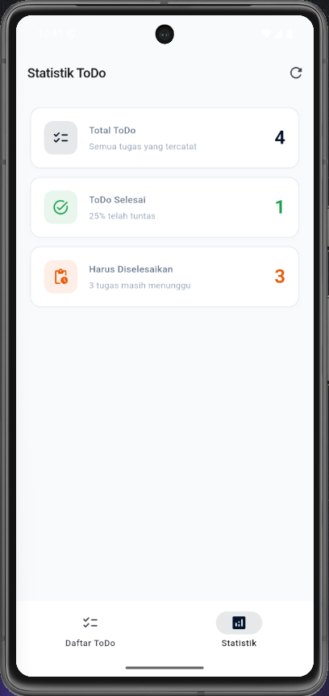

# Week 3 - Navigation & State Management

## Deskripsi

Mempelajari navigasi antar layar serta pengelolaan state pada aplikasi Flutter.

## Fokus

- Route dan navigation
- State management
- UI state
- App flow

## Praktikum 1 — Aplikasi multi-page dengan GoRouter

## Praktikum 2 — Aplikasi ToDo dengan Riverpod

## Praktikum 3 — Praktikum 3 — Uji ketiga state
2. Ubah build() sementara untuk melempar error: throw Exception('Gagal terhubung ke server');. Jalankan dan amati UI error beserta tombol Coba lagi.

4. **Refleksi:**
* **mengapa menampilkan ulang data lama (stale data) dengan indikator refresh kadang lebih baik daripada mengosongkan layar? Kapan pola itu penting?**
Menampilkan data lama (stale data) dengan indikator refresh di latar belakang jauh lebih baik daripada mengosongkan layar (blank spinner) karena mencegah hilangnya konteks visual pengguna (UI flicker/layout shift) dan memungkinkan pengguna tetap dapat membaca atau berinteraksi dengan informasi yang sudah ada tanpa terputus. Pola ini (stale-while-revalidate) sangat krusial diterapkan pada fitur seperti pull-to-refresh, linimasa media sosial, feed berita, dashboard produk, serta skenario jaringan tidak stabil atau offline-first, di mana menjaga pengalaman pengguna (user experience) yang mulus dan responsif jauh lebih bernilai dibanding memblokir seluruh antarmuka dengan layar kosong yang memicu frustrasi.

## AI Challenge
### AI Verification Checklist

- [x] **Apakah state diubah secara immutable (tidak ada state.add() atau mutasi list langsung)?**
  * **Ya.** State `List<StatItem>` bersifat *immutable*, di-assign ulang melalui `state = const AsyncLoading()` dan `state = await AsyncValue.guard(...)` tanpa melakukan mutasi langsung pada list. Model `StatItem` juga menggunakan field `final` yang *immutable*.
- [x] **Apakah ref.watch hanya dipakai di dalam build, dan ref.read di callback?**
  * **Ya.** `ref.watch(statsProvider)` hanya dipanggil di dalam method `build()` widget `StatsPage`. Sedangkan pada aksi interaksi pengguna seperti tombol refresh dan *retry*, digunakan `ref.read(statsProvider.notifier).retry()`.
- [x] **Apakah ketiga state AsyncValue benar-benar ditangani (bukan hanya success)?**
  * **Ya.** UI menangani ketiga kondisi secara eksplisit menggunakan `.when()`:
    * `loading`: Menampilkan `CircularProgressIndicator()` dan teks status pengambilan analitik.
    * `error`: Menampilkan pesan error terformat dan tombol `FilledButton` *Coba Lagi*.
    * `data`: Menampilkan `ListView.separated` yang memuat 3 item metrik penyelesaian ToDo (Total ToDo, ToDo Selesai, dan Harus Diselesaikan).
- [x] **Apakah provider dideklarasikan dengan tipe eksplisit dan tidak duplikat dengan provider lain?**
  * **Ya.** Dideklarasikan secara eksplisit: `final statsProvider = AsyncNotifierProvider<StatsNotifier, List<StatItem>>(StatsNotifier.new);` dan memiliki namespace terpisah tanpa duplikasi.
- [x] **Apakah kode AI memakai API Riverpod versi lama (StateProvider antipattern, StateNotifierProvider usang, atau Consumer bertingkat yang tidak perlu)? Perbaiki ke pola Notifier/ConsumerWidget.**
  * **Tidak.** Kode sepenuhnya menggunakan API Riverpod modern (Riverpod 2.x/3.x) dengan `AsyncNotifier` dan `ConsumerWidget`, tanpa menggunakan `StateProvider` maupun `StateNotifierProvider` usang.
- [x] **Jalankan flutter analyze dan flutter test, apakah hasil AI lolos tanpa warning?**
- Hasil flutter analyze & test 

## Refactoring Challenge
**Hasil Flutter analyze dan flutter test pada refactoring challenge:**

## Refleksi

1. **Kapan `setState` masih cukup, dan kapan state harus naik ke Riverpod?**
`setState` cukup untuk state lokal dan sederhana dalam satu widget (seperti toggle UI atau input lokal). State harus naik ke Riverpod jika bersifat global, perlu diakses lintas halaman, memuat logika bisnis terpisah, atau menangani alur asinkron yang kompleks.

2. **Apa perbedaan `context.go` dan `context.push`, dan kapan masing-masing tepat digunakan?**
`context.go` mengganti rute tanpa menumpuk histori (cocok untuk menu utama/tab bar), sedangkan `context.push` menumpuk rute baru di atas stack sehingga memiliki navigasi *back* (cocok untuk membuka halaman detail).

3. **Bagaimana `AsyncValue` mencegah bug dibanding tiga boolean terpisah?**
`AsyncValue` menyatukan status loading, error, dan data dalam satu tipe (*pattern matching*), sehingga mencegah kondisi inkonsisten (misal loading dan error aktif bersamaan) serta mewajibkan penanganan seluruh skenario lewat `.when()`.

4. **Bagian mana dari hasil AI yang Anda perbaiki, dan mengapa?**
Menghubungkan kalkulasi statistik langsung ke `todoListProvider` alih-alih memakai data *dummy*, agar metrik ToDo (total, selesai, tertunda) sinkron dan akurat secara *real-time*.

## Preview Hasil Akhir
### Halaman Daftar ToDo

### Halaman Statistik

