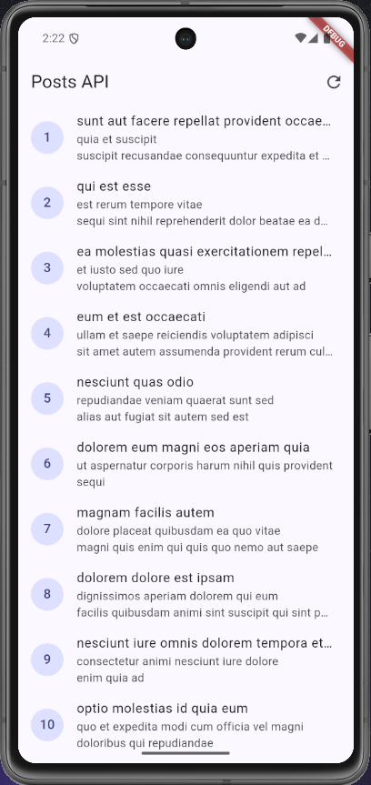
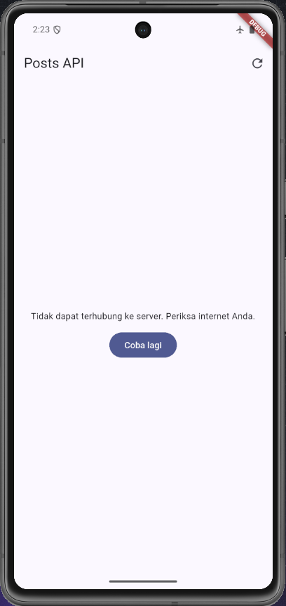
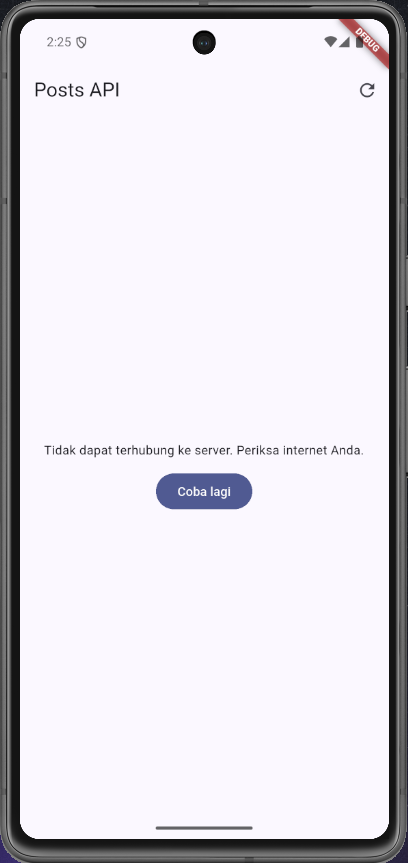
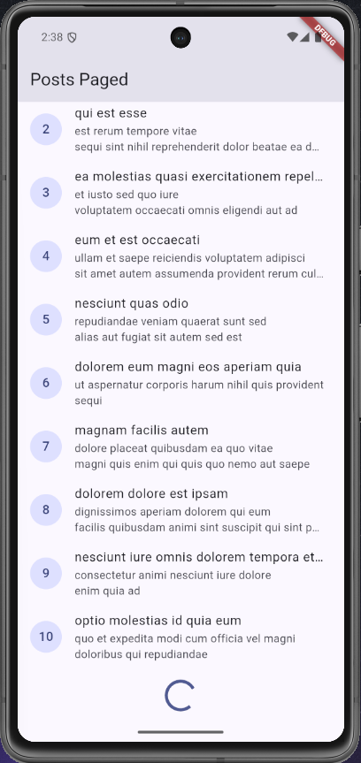
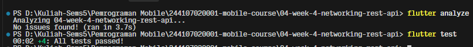
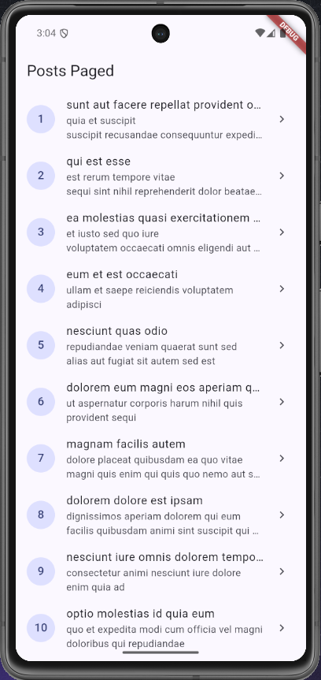
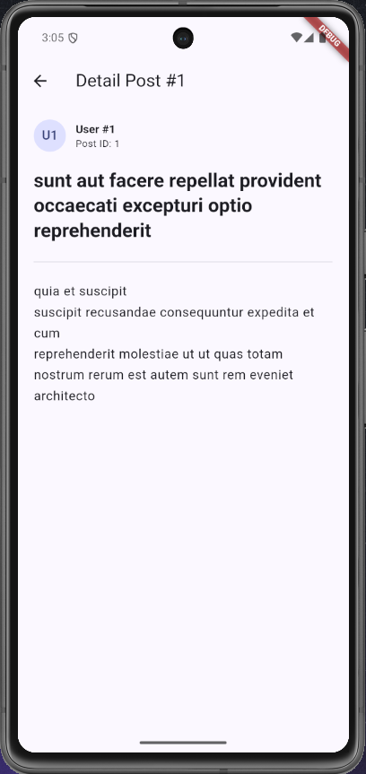
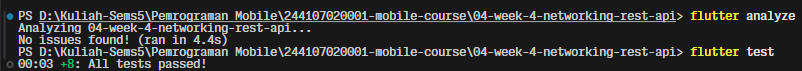

# Week 4 - Networking & REST API

## Deskripsi

Mempelajari komunikasi data, REST API, dan integrasi layanan web pada aplikasi mobile.

## Fokus

- HTTP request
- API integration
- JSON parsing
- Error handling

## PRAKTIKUM 2
### Uji Skenario Error
1. Skenario 1 – Internet Normal
    - Pengujian dilakukan saat emulator terhubung ke internet. Aplikasi berhasil mengambil data dari REST API dan menampilkan daftar post pada halaman.

2. Matikan internet (mode pesawat), tekan refresh, amati pesan ramah + tombol Coba lagi. Nyalakan kembali internet, tekan Coba lagi.
    - Pengujian dilakukan dengan mematikan koneksi internet emulator. Aplikasi gagal mengambil data dan menampilkan pesan “Tidak dapat terhubung ke server” serta tombol “Coba lagi”.

3. Skenario 3 – URL API Salah 
    - Pengujian dilakukan dengan mengganti URL API menjadi alamat yang salah. Aplikasi gagal terhubung ke server dan menampilkan pesan error yang mudah dipahami pengguna.

## PRAKTIKUM 3
### Hasil 

- Saat halaman di scroll hingga bawah, akan muncul progress indicator di bagian bawah halaman yang menunjukkan bahwa aplikasi sedang mengambil data halaman berikutnya.

## AI Prompt Challenge
### AI Verification Checklist
Sebelum kode AI diterima, verifikasi hal berikut dan catat temuan Anda di README:

1. **Apakah UI memanggil Dio secara langsung (dilarang) atau lewat repository?**
  - **Temuan:** Tidak memanggil langsung. UI hanya berinteraksi melalui Riverpod (`commentListProvider`), yang bertindak sebagai jembatan ke `CommentRepository`. Objek `Dio` diinjeksi ke repository melalui constructor (`CommentRepository(this._dio)`), sehingga logika networking terisolasi penuh dari UI layer.

2. **Apakah fromJson aman null, atau masih memakai cast langsung yang bisa crash?**
  - **Temuan:** Sudah aman null (`null-safe`). Model `Comment` tidak menggunakan direct casting berisiko seperti `json['name'] as String`, melainkan menggunakan safe casting nullable dengan nilai fallback:
    - `postId: (json['postId'] as num?)?.toInt() ?? 0`
    - `id: (json['id'] as num?)?.toInt() ?? 0`
    - `name: json['name'] as String? ?? ''`
    - `email: json['email'] as String? ?? ''`
    - `body: json['body'] as String? ?? ''`

3. **Apakah semua tipe DioExceptionType (timeout, connectionError, badResponse) dipetakan ke pesan pengguna?**
  - **Temuan:** Ya, telah dipetakan secara lengkap di fungsi `friendlyCommentErrorMessage(Object error)`:
    - `connectionTimeout`, `sendTimeout`, `receiveTimeout`: Dipetakan ke pesan timeout koneksi internet.
    - `connectionError`: Dipetakan ke pesan kegagalan koneksi jaringan.
    - `badResponse`: Menangani kode status spesifik **404** (data tidak ditemukan), **500** (gangguan server internal), serta status code lainnya.
    - Fallback default untuk tipe error yang tidak terduga.

4. **Apakah baseUrl/timeout terpusat di satu client, bukan tersebar di tiap method?**
  - **Temuan:** Ya, terpusat. Konfigurasi `baseUrl` (`https://jsonplaceholder.typicode.com`) dan timeout default (10 detik) didefinisikan secara terpusat pada `createDio()` di `lib/data/api_client.dart` dan disediakan lewat `dioProvider`. `CommentRepository` memanfaatkan instance terpusat tersebut.

5. **Apakah test AI benar-benar menguji kasus field hilang, atau hanya happy path? Tambahkan minimal 1 edge case sendiri.**
  - **Temuan:** Ya, unit test di `test/comment_model_test.dart` secara khusus menguji kasus payload kosong `{}` untuk memastikan fallback nilai default berjalan tanpa crash.
  - **Edge case tambahan yang diuji:**
    - Field bernilai `null` secara eksplisit (`'name': null`, `'body': null`).
    - Nilai `num` yang dikirim dalam format floating point/double (`'postId': 12.0`) untuk memastikan casting ke integer tetap aman.

6. **Jalankan flutter analyze dan flutter test, apakah hasil AI lolos tanpa warning?** 

## Refactoring dan testing
## Refactoring Challenge
- Hasil:
1. Halaman Posts List: 

2. Halaman Detail Comments: 

## Testing
- Hasil flutter analyze & test:

## REFLEKSI
1. Mengapa UI dilarang memanggil Dio langsung? Apa yang rusak jika aturan ini dilanggar?
    - **Jawab:** Jika UI memanggil Dio secara langsung, maka UI akan menjadi dependent langsung pada implementasi HTTP dan logic networking. Hal ini melanggar prinsip _Separation of Concerns_ dalam arsitektur aplikasi. Jika implementasi HTTP berubah (misalnya pindah ke другой HTTP client seperti http package atau menggunakan GraphQL), atau jika ada perubahan pada struktur response (seperti perlu penanganan error khusus, parsing JSON yang kompleks, atau interceptor), UI harus diubah secara langsung. Hal ini membuat UI menjadi rapuh (fragile), sulit diuji (difficult to test) tanpa melakukan request jaringan sungguhan, dan melanggar prinsip _Single Responsibility_ karena mencampurkan logika bisnis/UI dengan detail infrastruktur networking.
2. Kapan pagination client-side cukup, dan kapan harus mengandalkan pagination server (_page/_limit)?
    - **Jawab:** Pagination client-side cukup jika dataset kecil (misalnya kurang dari 100 item) dan client memiliki cukup memori untuk menampung seluruh data. Pagination server(_page/_limit) harus digunakan jika dataset besar (misalnya ribuan atau jutaan item) atau jika client memiliki keterbatasan memori.
3. Bagaimana exception repository berubah menjadi AsyncError tanpa try/catch di setiap widget? Kapan try/catch eksplisit tetap dibutuhkan?
    - **Jawab:** Exception repository berubah menjadi AsyncError tanpa try/catch di setiap widget karena exception yang dilempar di repository akan di-intercept oleh Riverpod dan dibungkus menjadi AsyncError. Try/catch eksplisit tetap dibutuhkan jika ingin menangani exception secara khusus atau memberikan pesan error yang berbeda dari pesan error default. Selain itu, try/catch juga dibutuhkan jika ingin melakukan validasi data sebelum dilempar ke widget. 
4. Bagian mana dari hasil AI yang Anda perbaiki, dan mengapa?
    - **Jawab:** Bagian yang diperbaiki adalah logika tampilan indikator loading dan kemampuan scroll pada halaman paged (PagedPostPage). Sebelumnya, CircularProgressIndicator terus berputar tanpa henti karena hanya mengecek kondisi hasMore tanpa memvalidasi status isLoadingMore, serta list tidak dapat digulir di Android karena konten 10 item awal muat dalam satu layar sehingga event scroll controller tidak pernah terpicu. Perbaikan dilakukan dengan menambahkan pengecekan isLoadingMore, menyematkan AlwaysScrollableScrollPhysics() dan subtitle item agar konten dapat di-scroll, serta menyesuaikan penanganan state AsyncValue.value dan mock test agar tidak memicu panggilan jaringan yang menggantung saat pengujian.