# Week 5 - Local Storage & Offline First

## Deskripsi

Mempelajari penyimpanan lokal dan pendekatan offline-first pada aplikasi mobile.

## Fokus

- Shared preferences
- Local database
- Cache data
- Offline strategy

## PRAKTIKUM 3
* Gambar 1 Mengaktifkan Force Offline:
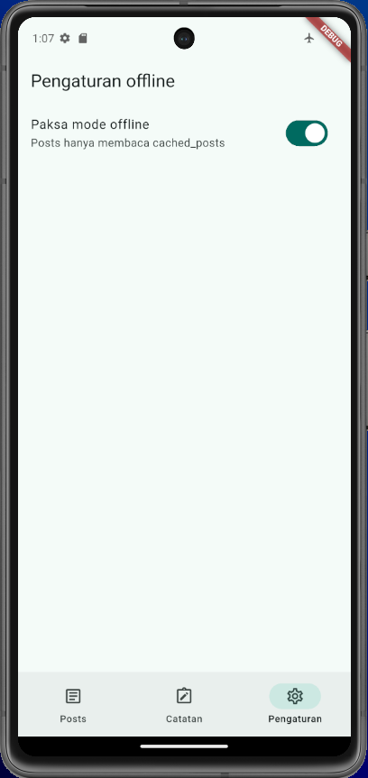
* Gambar 2 Menambah Catatan:
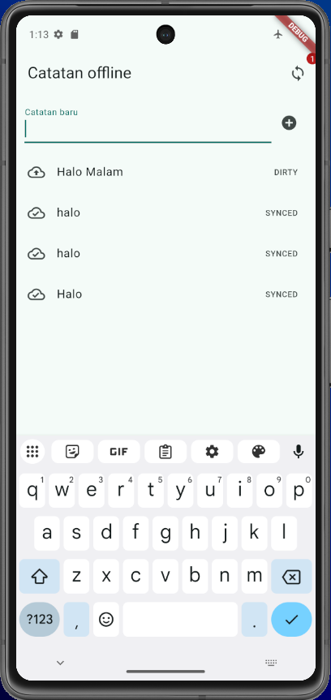
* Gambar 3 Badge Catatan:
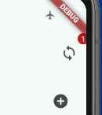
* Gambar 4 Badge Catatan Setelah Sinkronisasi:
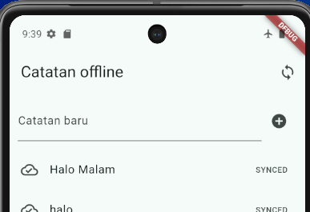
- Langkah:
	1. Jalankan aplikasi saat perangkat atau emulator terhubung ke internet.
	2. Buka tab **Posts**, kemudian tekan tombol refresh untuk mengambil data dari endpoint JSONPlaceholder.
	3. Data post disimpan ke database lokal pada tabel `cached_posts`.
	4. Buka tab **Pengaturan**, lalu aktifkan toggle **Paksa mode offline** seperti pada Gambar 1.
	5. Kembali ke tab **Posts**, kemudian tutup dan buka kembali aplikasi untuk menguji data lokal.
	6. Buka tab **Catatan**, tambahkan satu atau beberapa catatan baru.
	7. Periksa badge sinkronisasi dan label catatan sebelum proses sync dijalankan.
	8. Tekan tombol **Sync catatan**. Aplikasi mensimulasikan proses upload selama satu detik.
	9. Setelah proses selesai, periksa kembali badge dan status catatan.

- Observasi:
	- Saat mode offline aktif, daftar post tetap dapat ditampilkan dari tabel `cached_posts` meskipun tidak ada koneksi internet.
	- Aplikasi tidak bergantung pada Wi-Fi untuk menampilkan cache yang sudah tersimpan.
	- Catatan baru langsung tersimpan di database lokal, sehingga tetap tersedia saat aplikasi dibuka kembali dalam kondisi offline.
	- Catatan baru memiliki status `DIRTY` dan badge menampilkan jumlah catatan yang belum disinkronkan.
	- Setelah tombol **Sync catatan** dijalankan, simulasi upload selesai dan seluruh catatan dirty ditandai `SYNCED`.
	- Badge dirty berubah menjadi `0` setelah proses sinkronisasi berhasil.
	- Toggle **Paksa mode offline** membuat pengujian offline deterministik dan tidak bergantung pada kondisi jaringan kelas.

## AI Verification Checklist
1. **Apakah AI menempatkan daftar catatan di SharedPreferences? (menolak: rapuh untuk koleksi).**
AI menyarankan SharedPreferences digunakan untuk menyimpan preferensi aplikasi, seperti pengaturan tema. AI tidak menyarankan daftar catatan disimpan di SharedPreferences.Hal ini sesuai dengan project yang dibuat. Pada project ini, SharedPreferences digunakan untuk menyimpan dark_mode dan waktu terakhir aplikasi dibuka. Sedangkan data catatan disimpan menggunakan SQLite melalui sqflite.
2. **Apakah skema AI mendukung antrean sync (dirty flag / updated_at) atau hanya CRUD polos?**
AI memberikan contoh skema yang memiliki updated_at dan sync_status. Artinya, AI tidak hanya memikirkan CRUD, tetapi juga memperhatikan kebutuhan sinkronisasi data.
Pada project yang dibuat, tabel notes memiliki updated_at dan dirty. Field dirty digunakan untuk mengetahui apakah catatan masih perlu disinkronkan atau sudah selesai disinkronkan. Field updated_at digunakan untuk menyimpan waktu terakhir catatan diperbarui.
Jadi, kebutuhan antrean sync pada project sudah dapat diterapkan walaupun nama field yang digunakan berbeda dengan contoh dari AI.
3. **Apakah klaim "real-time" AI didukung stream (Drift/watch) atau hanya asumsi?**
AI menyarankan penggunaan stream untuk mendukung real-time update. Pada project yang dibuat, tabel notes menggunakan stream untuk menampilkan daftar catatan secara real-time. Jadi, klaim "real-time" AI didukung oleh stream.
4. **Apakah estimasi boilerplate AI masuk akal setelah Anda mencoba instalasinya (flutter pub add + migrasi skema)?**
AI menjelaskan bahwa Drift membutuhkan konfigurasi tambahan seperti code generation dan build_runner. Namun, saya belum melakukan percobaan langsung untuk menginstal Drift dan membuat migration pada project.
Karena belum melakukan percobaan tersebut, saya belum dapat memastikan secara langsung apakah jumlah boilerplate yang dijelaskan AI benar-benar sesuai dengan kondisi saat instalasi.
5. **Keputusan final Anda beserta alasannya, boleh berbeda dari rekomendasi AI selama berargumen.**
Setelah melakukan verifikasi, saya memilih menggunakan SharedPreferences untuk menyimpan preferensi dan sqflite untuk menyimpan catatan. SharedPreferences digunakan karena data yang disimpan hanya berupa pengaturan sederhana seperti dark_mode. Sementara itu, sqflite digunakan untuk menyimpan catatan karena data catatan membutuhkan database yang lebih terstruktur dan dapat digunakan untuk CRUD. Selain itu, sqflite sudah dapat memenuhi kebutuhan project saat ini. Tabel notes sudah memiliki dirty dan updated_at yang digunakan untuk mendukung proses sinkronisasi data. Oleh karena itu, saya tetap menggunakan SharedPreferences + sqflite dan tidak mengganti implementasi project menjadi Drift.

## REFACTORING DAN TESTING
### Checklist Verifikasi Mandiri
1. **UI tidak memanggil SQLite/SharedPreferences langsung; semua lewat repository + provider.**
**Jawaban:** Ya, UI tidak memanggil SQLite/SharedPreferences langsung. Semua akses data dilakukan melalui repository dan provider. Repository bertanggung jawab untuk mengelola data dari database lokal (SQLite) dan SharedPreferences, sedangkan provider digunakan untuk menyediakan data ke UI.

2. **Aplikasi penuh berfungsi dalam mode pesawat: baca, tambah, hapus catatan.**
**Jawaban:** Ya, aplikasi dapat berfungsi penuh dalam mode pesawat. Pengguna dapat membaca, menambah, dan menghapus catatan tanpa koneksi internet. Semua perubahan disimpan di database lokal (SQLite) dan akan disinkronkan ke server saat koneksi internet tersedia.

3. **Badge dirty akurat sebelum/sesudah sync; cache posts tampil tanpa internet.**
**Jawaban:** Ya, badge dirty akurat sebelum dan sesudah proses sinkronisasi. Sebelum sinkronisasi, badge menampilkan jumlah catatan yang belum disinkronkan (dirty). Setelah proses sinkronisasi selesai, badge akan berubah menjadi 0, menandakan bahwa semua catatan telah disinkronkan. Selain itu, cache posts tetap dapat ditampilkan tanpa koneksi internet karena data post disimpan di database lokal (SQLite) pada tabel `cached_posts`.

## Hasil
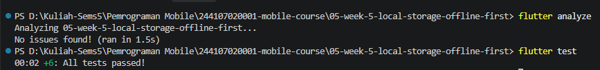

## REFLEKSI
**1. Mengapa daftar catatan tidak boleh disimpan di SharedPreferences? Apa yang rusak jika aturan ini dilanggar?**
Daftar catatan tidak boleh disimpan di SharedPreferences karena SharedPreferences dirancang untuk menyimpan data sederhana dalam bentuk key-value, seperti pengaturan aplikasi. Jika kita menyimpan daftar catatan yang kompleks dan besar di SharedPreferences, beberapa masalah bisa muncul:
- **Kinerja buruk:** SharedPreferences tidak dioptimalkan untuk menyimpan data besar atau kompleks, sehingga bisa menyebabkan aplikasi menjadi lambat saat membaca atau menulis data.
- **Kesulitan dalam operasi CRUD:** SharedPreferences tidak mendukung operasi database yang kompleks seperti query, filter, atau update sebagian data. Ini membuat pengelolaan catatan menjadi sulit.
- **Risiko korupsi data:** Jika aplikasi crash atau terjadi kesalahan saat menulis data ke SharedPreferences, ada risiko data menjadi korup dan hilang. Dengan menggunakan database lokal seperti SQLite, kita mendapatkan fitur transaksi yang lebih aman dan dapat mengurangi risiko kehilangan data.

**2. Kapan cache-first cukup, dan kapan Anda membutuhkan strategi lain (misalnya network-first)?**
Cache-first itu cocok kalau datanya jarang berubah dan kita ingin aplikasi tetap bisa jalan walau offline, misalnya daftar post yang diambil dari server. Tapi kalau datanya sering diperbarui atau kita butuh informasi paling baru, strategi network-first lebih tepat. Dengan network-first, aplikasi akan mencoba ambil data dari server dulu, dan kalau gagal baru pakai cache. Jadi, cache-first untuk data statis atau jarang berubah, sedangkan network-first untuk data dinamis yang harus selalu up-to-date.

**3. Bagaimana dirty flag berubah menjadi antrean sync tanpa memblokir UI? Kapan antrean terpisah (tabel outbox) menjadi perlu?**
Dirty flag itu ibarat tanda "belum sinkron" di catatan kita. Saat user menambah atau mengubah catatan, aplikasi langsung menandai catatan itu sebagai dirty dan menyimpannya di database lokal. Di belakang layar, ada proses sinkronisasi yang berjalan sendiri (misalnya pakai background service atau worker) yang membaca catatan dirty satu per satu dan mengirimkannya ke server. Karena proses ini berjalan di thread terpisah, UI tetap bisa digunakan tanpa lag. Kalau jumlah catatan dirty sangat banyak atau proses sinkronisasi butuh logika lebih kompleks (misalnya retry otomatis, urutan tertentu, atau batch), maka kita bisa buat tabel outbox khusus untuk antrean sync agar lebih rapi dan mudah dikelola.

**4. Bagian mana dari rekomendasi AI yang Anda tolak, dan mengapa?**
Saya menolak rekomendasi AI untuk menyimpan daftar catatan di SharedPreferences. Alasannya, SharedPreferences tidak dirancang untuk menyimpan data yang kompleks dan besar seperti daftar catatan. Menggunakan SharedPreferences untuk tujuan ini dapat menyebabkan masalah performa, kesulitan dalam melakukan operasi CRUD, dan risiko korupsi data. Sebagai gantinya, saya memilih menggunakan SQLite melalui sqflite untuk menyimpan catatan, karena lebih sesuai dengan kebutuhan aplikasi yang memerlukan penyimpanan data terstruktur dan mendukung operasi database yang lebih kompleks.

## HASIL AKHIR
## Flutter Analyze & Test
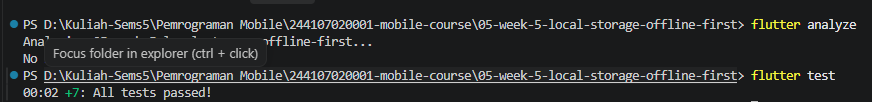
### Light Mode:
[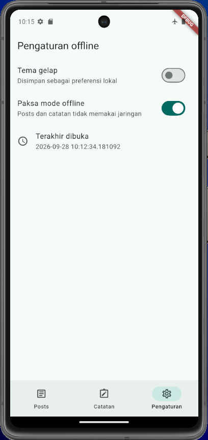]
### Dark Mode:
[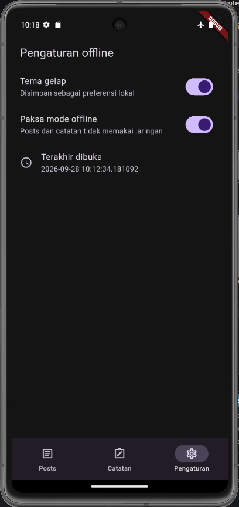]
### Menambahkan Catatan:
[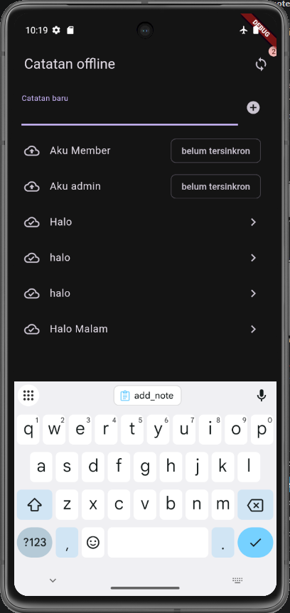]
### Melakukan Sync Data Saat Force Offline Off
[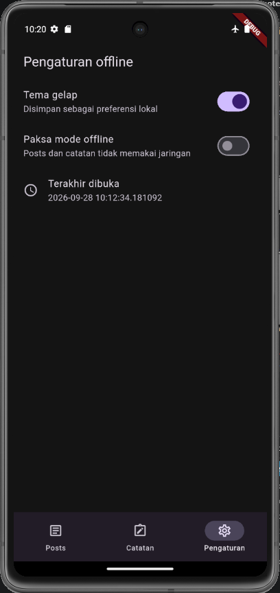]
[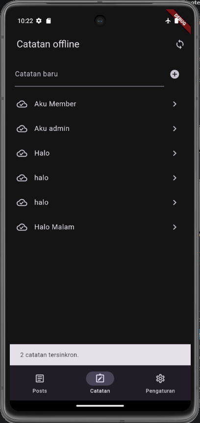]
### Melakukan Sync Data Saat Force Offline On
[]
[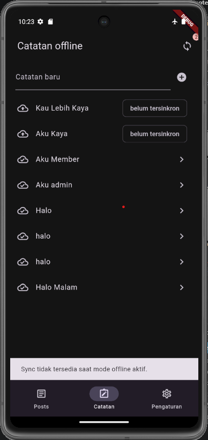]

